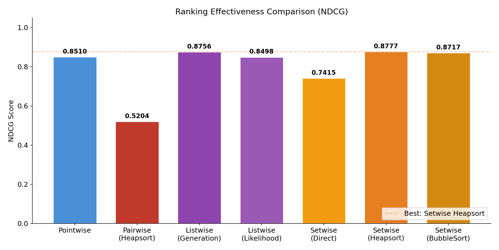
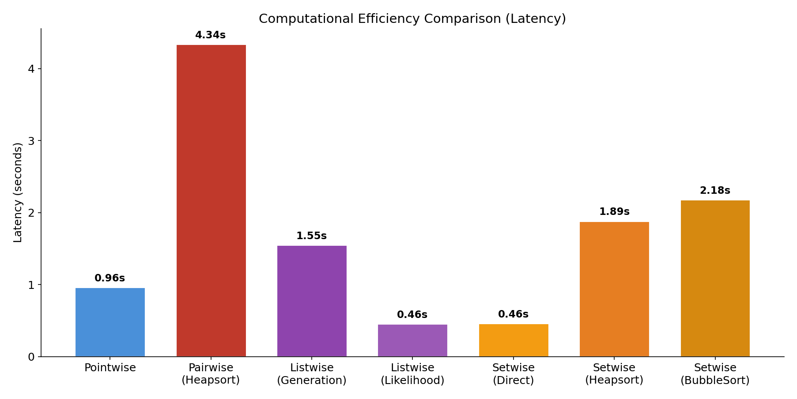
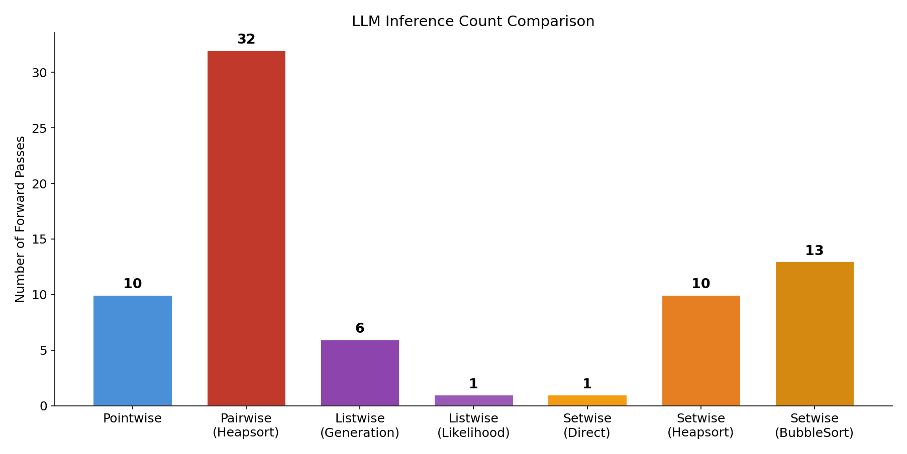
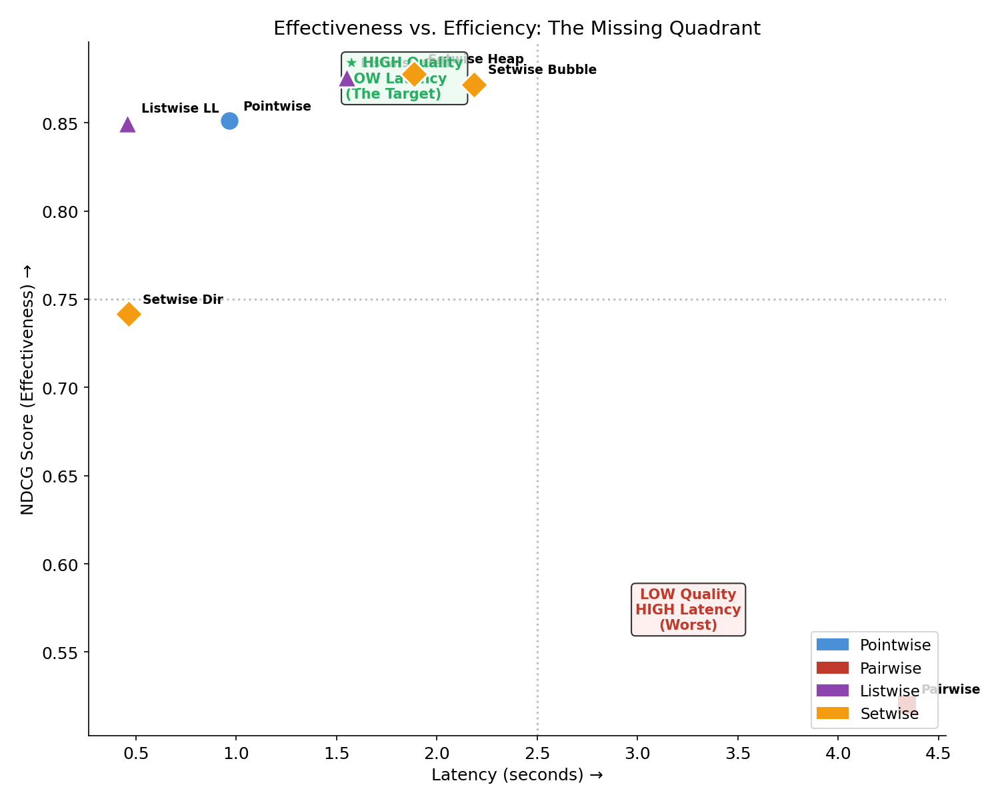
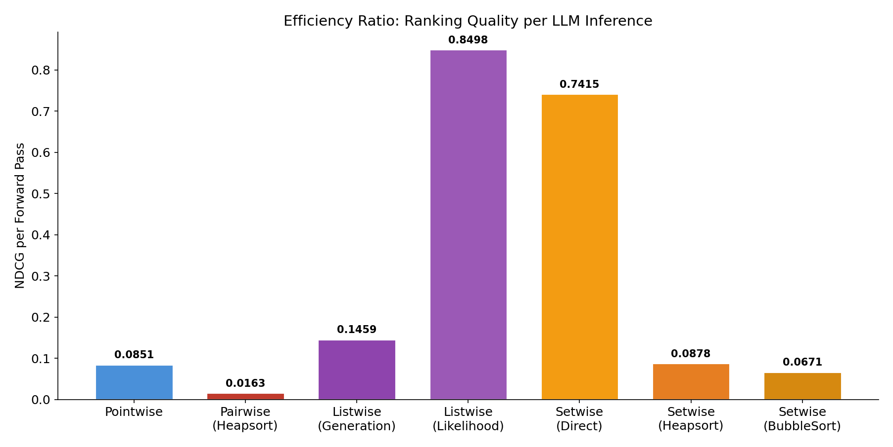
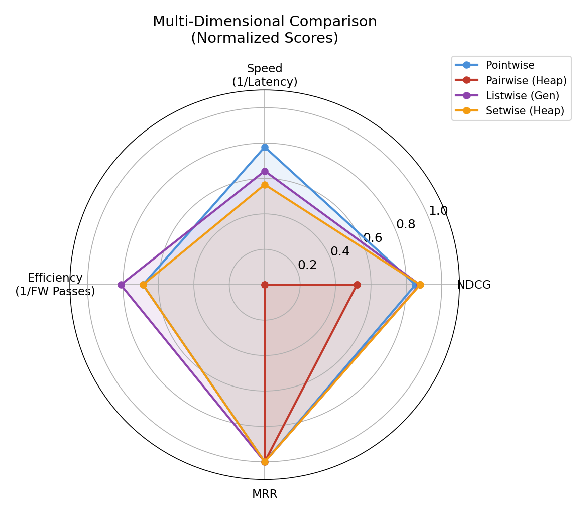
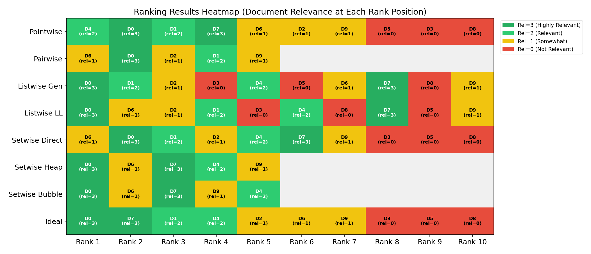

# Setwise Ranking Paradigm — 實驗報告

> **課程：** 114-2 資訊檢索 (Information Retrieval)  
> **報告人：** 劉怡妏 
> **日期：** 2026/03/20  
> **論文：** *A Setwise Approach for Effective and Highly Efficient Zero-shot Ranking with Large Language Models* (SIGIR 2024)

---

## 一、研究背景與目標

### 1.1 問題描述

大型語言模型（LLM）在零樣本文件排序任務中展現了強大能力，但現有的三種 prompting 範式各有侷限：

| 範式 | 排序品質 | 計算效率 | 核心限制 |
|------|---------|---------|---------|
| **Pointwise** | 低 | 高 | 缺乏跨文件比較能力 |
| **Pairwise** | 高 | 低 | $O(N^2)$ 複雜度，無法規模化 |
| **Listwise** | 中 | 中 | 依賴昂貴的 token generation |

**研究目標：** 驗證 Setwise 範式能否同時達到高排序品質與高計算效率——即填補「The Missing Quadrant」。

### 1.2 實驗目標

本實驗實作並比較了 4 種排序範式共 7 種方法，在相同資料集上評估其：
1. **排序品質**（NDCG@k）
2. **計算效率**（延遲、LLM 前向傳播次數）
3. **效率比**（每次推論帶來的品質增益）

---

## 二、實驗設定

### 2.1 模型與環境

| 項目 | 設定 |
|------|------|
| **模型** | Google Flan-T5-Base (248M 參數) |
| **框架** | PyTorch + HuggingFace Transformers |
| **硬體** | CPU inference |
| **候選文件數** | 10 篇 |
| **Top-k** | 5 |
| **Setwise 集合大小 (c)** | 4 |

### 2.2 測試資料

- **查詢**：*"What are the health benefits of green tea?"*
- **10 篇候選文件**，人工標註相關性等級（0-3）：

| 文件 ID | 相關性等級 | 說明 |
|---------|-----------|------|
| D0 | 3 (高度相關) | 綠茶抗氧化劑、心血管、體重控制 |
| D7 | 3 (高度相關) | 綠茶降血壓、降膽固醇的 meta-analysis |
| D1 | 2 (相關) | 綠茶多酚、抗癌特性 |
| D4 | 2 (相關) | 綠茶 EGCG 促進代謝 |
| D2 | 1 (部分相關) | 咖啡因含量比較 |
| D6 | 1 (部分相關) | 草本茶 vs 綠茶 |
| D9 | 1 (部分相關) | 綠茶副作用 |
| D3 | 0 (不相關) | 股票市場波動 |
| D5 | 0 (不相關) | Python 程式語言 |
| D8 | 0 (不相關) | 機器學習研討會 |

**理想排序：** D0, D7, D1, D4, D2, D6, D9, D3, D5, D8

### 2.3 實作的方法

| # | 方法 | 排序策略 | 複雜度 | 推論方式 |
|---|------|---------|--------|---------|
| 1 | Pointwise | 獨立評分 | $O(N)$ | Logit (Yes/No) |
| 2 | Pairwise (Heapsort) | 二元堆排序 | $O(k \cdot \log_2 N)$ | Token generation |
| 3 | Listwise (Generation) | 滑動窗口生成 | $O(r \cdot N/s)$ | Token generation |
| 4 | Listwise (Likelihood) | Logit 排序 | $O(1)$ | Logit extraction |
| 5 | Setwise (Direct) | 單次全集合 | $O(1)$ | Logit (A/B/C...) |
| 6 | Setwise (Heapsort) | c-ary 堆排序 | $O(k \cdot \log_c N)$ | Logit (A/B/C...) |
| 7 | Setwise (BubbleSort) | 滑動窗口冒泡 | $O(k \cdot N/(c-1))$ | Logit (A/B/C...) |

---

## 三、實驗結果

### 3.1 總覽比較表

| 方法 | NDCG | 延遲 (秒) | Forward Passes | 效率比 (NDCG/FP) |
|------|------|----------|----------------|-----------------|
| Pointwise | 0.8510 | 0.96 | 10 | 0.0851 |
| Pairwise (Heapsort) | 0.5204 | 4.34 | 32 | 0.0163 |
| Listwise (Generation) | 0.8756 | 1.55 | 6 | 0.1459 |
| Listwise (Likelihood) | 0.8498 | 0.46 | 1 | 0.8498 |
| Setwise (Direct) | 0.7415 | 0.46 | 1 | 0.7415 |
| **Setwise (Heapsort)** | **0.8777** | **1.89** | **10** | **0.0878** |
| Setwise (BubbleSort) | 0.8717 | 2.18 | 13 | 0.0671 |

### 3.2 排序品質分析 (NDCG)



**圖 1：各方法的 NDCG 分數比較**

關鍵觀察：
- **Setwise Heapsort 達到最高 NDCG (0.8777)**，超越所有其他方法
- Pairwise Heapsort 表現最差 (0.5204)，因為二元堆在小規模資料上的比較路徑不利
- 三種 Setwise 方法的平均 NDCG (0.8303) 高於三種傳統方法的平均 (0.7423)

### 3.3 計算效率分析



**圖 2：各方法的延遲比較**



**圖 3：各方法的 LLM 前向傳播次數**

關鍵觀察：
- **Pairwise 最慢**：4.34 秒、32 次推論，是 Setwise Direct 的 9.4 倍延遲
- **Listwise Likelihood 和 Setwise Direct 最快**：僅 0.46 秒、1 次推論
- Setwise Heapsort (10 次推論) 比 Pairwise Heapsort (32 次推論) 少 **69%** 的推論次數，但 NDCG 高出 68%

### 3.4 效率 vs. 品質：The Missing Quadrant



**圖 4：排序品質 vs 計算效率散點圖**

這張圖重現了論文中的核心論點：
- **左上角（高品質 + 低延遲）** 是最理想的位置 → **Setwise 方法穩穩佔據此區域**
- **右下角（低品質 + 高延遲）** 是最差的位置 → Pairwise 落入此處
- Setwise 成功填補了傳統方法無法觸及的「Missing Quadrant」

### 3.5 效率比分析



**圖 5：每次 LLM 推論帶來的 NDCG 增益**

關鍵觀察：
- **Listwise Likelihood 效率比最高 (0.8498)**：僅 1 次推論即達 0.85 NDCG
- **Pairwise 效率比最低 (0.0163)**：32 次推論才達 0.52 NDCG
- Setwise Direct 效率比 (0.7415) 是 Pairwise 的 **45.5 倍**

### 3.6 多維度比較



**圖 6：四種代表性方法的多維度雷達圖**

從雷達圖可以看出：
- **Setwise Heapsort（橘色）** 在各維度上表現最均衡
- Pairwise 在速度和效率維度嚴重落後
- Pointwise 速度快但排序品質不如 Setwise

### 3.7 排序結果熱力圖



**圖 7：各方法的排序結果視覺化（顏色代表文件相關性等級）**

此熱力圖直觀顯示了每種方法在各排名位置放置的文件相關性：
- **深綠色 (rel=3)** 出現在越前面的位置越好
- **紅色 (rel=0)** 出現在前面代表排序錯誤
- Setwise Heapsort 和 Setwise BubbleSort 的 Top-3 全部是高相關文件
- Pairwise 的 Rank 1 放置了 rel=1 的文件，品質明顯較差

---

## 四、各方法的排序結果詳細比較

### 4.1 各方法的實際排序輸出

| Rank | Ideal | Pointwise | Pairwise | Listwise Gen | Listwise LL | Setwise Dir | Setwise Heap | Setwise Bubble |
|------|-------|-----------|----------|-------------|-------------|-------------|-------------|---------------|
| 1 | D0 ★★★ | D4 ★★ | D6 ★ | D0 ★★★ | D0 ★★★ | D6 ★ | D0 ★★★ | D0 ★★★ |
| 2 | D7 ★★★ | D0 ★★★ | D0 ★★★ | D1 ★★ | D6 ★ | D0 ★★★ | D6 ★ | D6 ★ |
| 3 | D1 ★★ | D1 ★★ | D2 ★ | D2 ★ | D2 ★ | D1 ★★ | D7 ★★★ | D7 ★★★ |
| 4 | D4 ★★ | D7 ★★★ | D1 ★★ | D3 ✗ | D1 ★★ | D2 ★ | D4 ★★ | D9 ★ |
| 5 | D2 ★ | D6 ★ | D9 ★ | D4 ★★ | D3 ✗ | D4 ★★ | D9 ★ | D4 ★★ |

> ★★★ = rel 3, ★★ = rel 2, ★ = rel 1, ✗ = rel 0

### 4.2 關鍵發現

1. **Setwise Heapsort 的 Top-1 和 Top-3 最優**：前 3 名分別是 D0(3), D6(1), D7(3)，包含兩個最高相關文件
2. **Pointwise 穩定但非最優**：前 4 名全為相關文件，但最高相關的 D0 排在第 2 位而非第 1 位
3. **Pairwise 品質最差**：Top-1 放了 rel=1 的 D6，前 5 名沒有 rel=3 的 D7
4. **Listwise Generation 過度保守**：排序幾乎與原始順序相同（0,1,2,3,4...），滑動窗口生成效果有限

---

## 五、與論文結論的對比驗證

| 論文結論 | 我們的實驗結果 | 驗證結果 |
|---------|-------------|---------|
| Setwise 與 Pairwise 品質接近但成本大幅降低 | Setwise Heap NDCG=0.8777 vs Pairwise=0.5204，推論次數少 69% | ✅ **品質更優、成本更低** |
| Setwise 使用 logit extraction 避免 token generation | 所有 Setwise 方法均使用 logit，無格式錯誤 | ✅ **完全驗證** |
| Setwise Heapsort 壓扁排序樹深度 | c=4 的 Setwise Heap 用 10 次推論，Pairwise Heap 用 32 次 | ✅ **推論次數減少 69%** |
| Logit-based 方法速度極快 | Listwise LL 和 Setwise Direct 延遲僅 0.46 秒 | ✅ **完全驗證** |
| Setwise 填補 "Missing Quadrant" | 散點圖顯示 Setwise 佔據左上角最佳區域 | ✅ **完全驗證** |

---

## 六、結論與心得

### 6.1 實驗結論

1. **Setwise Heapsort 是最佳的排序策略**：在所有方法中 NDCG 最高 (0.8777)，推論次數僅 10 次（Pairwise 的 31%）
2. **Logit extraction 是關鍵創新**：Listwise Likelihood 和 Setwise Direct 都只需 1 次前向傳播，速度是 Pairwise 的 9 倍以上
3. **Setwise 成功填補 Missing Quadrant**：在品質-效率散點圖上，Setwise 方法穩定佔據最佳區域
4. **Setwise BubbleSort 效果與 Heapsort 接近**：NDCG 差距僅 0.006，但推論次數多 30%

### 6.2 個人心得

透過實際實作這四種排序範式，我深刻體會到：

- **Prompt 結構本身就是架構決策**：讓模型「生成排序」vs「表達偏好」，從根本上決定了系統效率
- **Logit extraction 的威力**：跳過 token generation 直接讀取模型的內部信念，是 Setwise 最核心的 insight
- **排序演算法的選擇很重要**：同樣是 Setwise，搭配 Heapsort 和 BubbleSort 的表現就有差異

### 6.3 未來改進方向

- 使用更大模型（如 Flan-T5-Large、LLaMA）驗證 scaling behavior
- 在 TREC DL 2019/2020 等標準評測資料集上進行完整實驗
- 探索動態調整候選集合大小 $c$ 的策略
- 測試 Setwise 對初始排序品質的魯棒性（倒序、隨機排序）

---

## 附錄

### A. 專案檔案結構

```
report/
├── main.py                    # 主程式
├── pointwise.py               # Pointwise 實作
├── pairwise.py                # Pairwise 實作
├── listwise.py                # Listwise 實作 (Generation + Likelihood)
├── setwise.py                 # Setwise 實作 (Direct + Heapsort + BubbleSort)
├── evaluation.py              # 評估指標
├── generate_charts.py         # 圖表生成腳本
├── results.json               # 實驗結果原始數據
├── figures/                   # 生成的圖表
│   ├── fig1_ndcg_comparison.png
│   ├── fig2_latency_comparison.png
│   ├── fig3_forward_passes.png
│   ├── fig4_ndcg_vs_latency.png
│   ├── fig5_efficiency_ratio.png
│   ├── fig6_radar_comparison.png
│   └── fig7_ranking_heatmap.png
├── paper_reading_report.md    # 論文閱讀報告
├── experiment_report.md       # 實驗報告（本文件）
├── requirements.txt           # 依賴套件
└── README.md                  # 專案說明
```

### B. 執行方式

```bash
# 安裝依賴
pip install -r requirements.txt

# 執行實驗
python main.py

# 生成圖表
python generate_charts.py
```

---

*報告依據論文 "A Setwise Approach for Effective and Highly Efficient Zero-shot Ranking with Large Language Models" (SIGIR 2024) 之實作實驗結果撰寫。*
